# IAR - ANN
Eliton Machado da Silva

## Relatório Técnico

### 1. Analise exploratória dos dados

A primeira etapa deste trabalho consistiu em explorar e adquirir conhecimento sobre os dados do problema

Pode-se adquirir diversas informações relevantes procurando por padrões nos dados, como, por exemplo, a distribuição dos dados, a correlação entre as variáveis, a existência de outliers, entre outros.

No problema apresentado, os dados são divididos em três conjuntos, o primeiro contendo 300 dados de motores com funcionamento normal, o segundo contendo 100 de motores com falha de um tipo específico e o terceiro com 100 de outra falha.

Foram encontrados 23 dados de valor nulos, sendo que 13 deles pertenciam ao conjunto de motores sem falha, 3 ao conjunto de dados de motores com falha do tipo 1 e 7 aos do tipo 2.

Analisando métricas estatisticas dos dados, pode-se observar que os dados de motores sem falha possuem desvio padrão menor que dos outros, o que indica que os dados dos motores sem falha são mais homogêneos.

Além disso, percebe-se a existencia de outliers nos dados de motores com falha, o que pode indicar que os dados de motores com falha são mais heterogêneos.

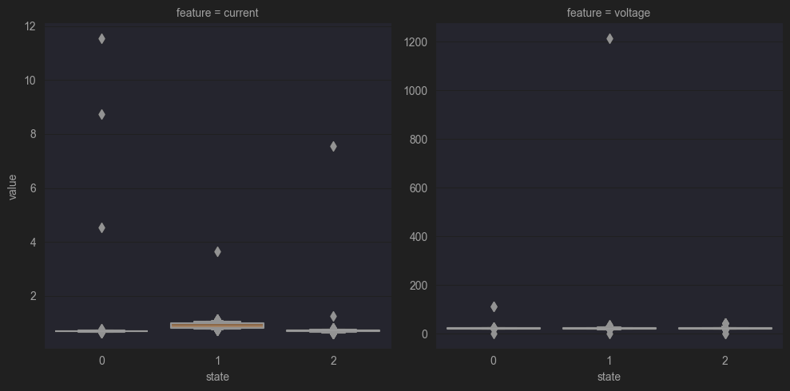

A imagem acima mostra a distribuição dos dados de tensão e corrente dos motores sem falha, os dados de motores com falha do tipo 1 e os dados de motores com falha do tipo 2. Tambem pode-se observar a presença de outliers nos dados.

Devido à abundância de dimensões, 1000 colunas para a corrente e 1000 colunas para a tensão, não foi possível a visualizacao dos dados em um gráfico 3D, mas é possível analisar a relacão entre as médias das duas variaveis de entradas em um gráfico 2D, como pode ser observado na imagem abaixo.

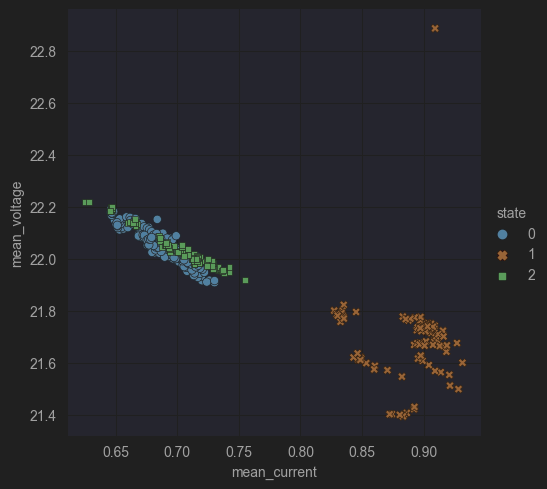

A imagem acima mostra a relação entre as médias das variáveis de entrada, a tensão e a corrente, dos motores sem falha, dos motores com falha do tipo 1 e tipo 2. Observa-se que os motores com falha do tipo 1 possuem médias de corrente maiores que os outros e médias de tensão menores que os de outras categorias, enquanto os motores das outras duas categorias possuem médias muito próximas. Desta maneira, a média não é suficiente para separação dos dados.

Devido à abundacia de dimensões, seria interessante a diminuicao da quantidade de variaveis de entrada do modelo, para isso, foi analisado o comportamento de uma porção aleatória dos dados.

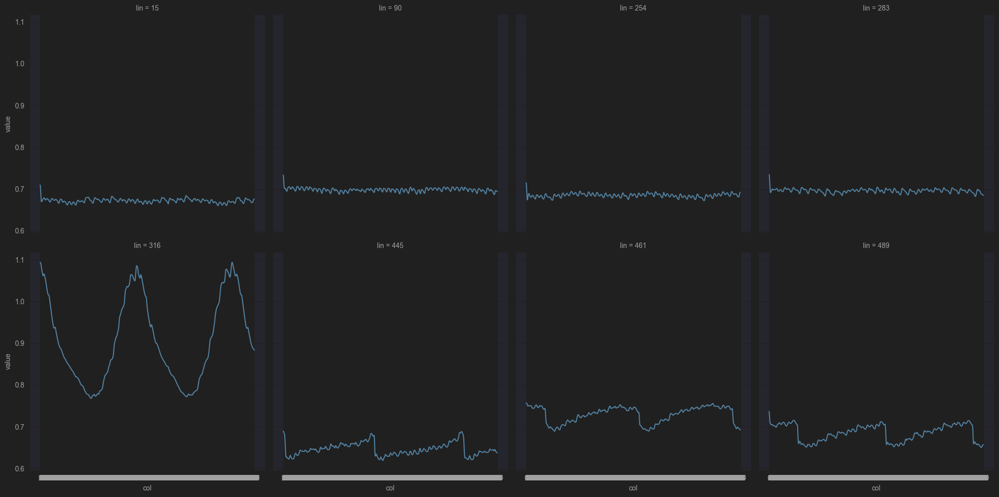

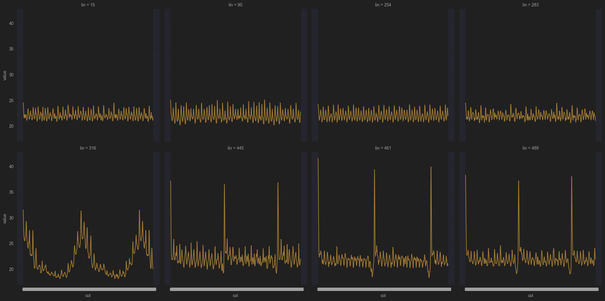

Acima, pode-se observar a distribuição dos dados de motores sem falha, dos motores com falha do tipo 1 e dos motores com falha do tipo 2, para 8 baterias de testes escolhidas aleatóriamente. Além destes, foram analisados varias baterias de testes para as 3 categorias de motores, no entando os plots não foram apresentados no relatório por motivos de espaço.

Observa-se um comportamento ciclico nos sinais de corrente e tensão nos dados, além disso, por ser um sinal continuo, pode-se reduzir a quantidade de variaveis de entrada do modelo para 100, ao invés de 1000, sem perder a informação do comportamento do sinal. No entanto, se os dados forem selecionados de forma aleatória, pode-se obter ruido, o que interfereria no comportamento da curva. Para garantir que os dados selecionados não contenham ruido, foi aplicado um filtro para suavisação do sinal.

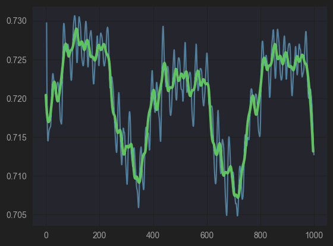

Acima pode-se observar os dados de corrente de uma bateria de testes e em verde a curva suavizada do sinal. A curva suavizada foi obtida aplicando o filtro Savitzky-Golay.

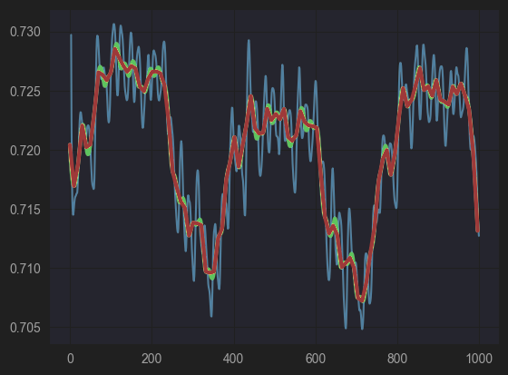

Acima pode-se observar o mesmo gráfico anterior com uma terceira curva em vermelho, está é a aproximação feita com 100 dados. 

### 2. Pré-processamento dos dados

Na etapa de pré-processamento dos dados os valores não numéricos foram removidos, removeram-se as colunas devido a sua presença em maior quantidade. Os outliers foram removidos de forma similar, utilizando o zscore, com limite escolhido empiricamente, para identificalos.

Para reduzir a quantidade de variáveis de entrada do modelo, foi aplicado um filtro para suavização do sinal, o filtro Savitzky-Golay, em todas as baterias de testes, em seguida, foram selecionadas 100 variáveis de entrada igualmente espaçadas.

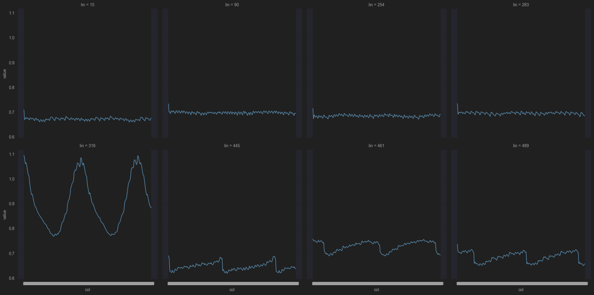

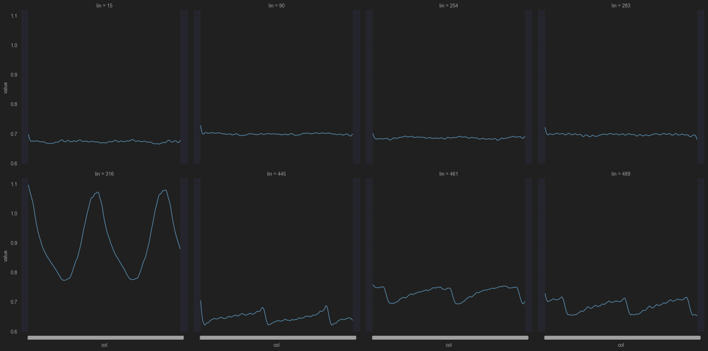

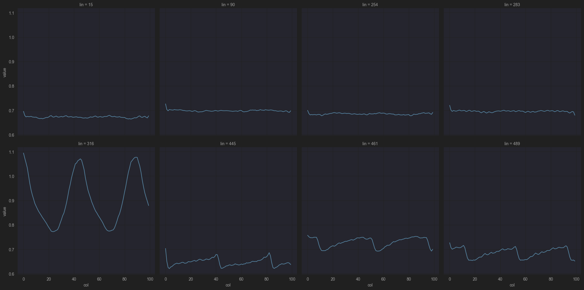

As imagens acima mostram esse processo para o sinal de corrente de 8 baterias de testes escolhidas aleatóriamente, a primeira imagem mostra a curva original, a segunda mostra a curva suavizada e a terceira demonstra o resultado com o sinal aproximado com 100 pontos. Dessa forma foi possível reduzir a quantidade de variáveis de entrada do modelo de 2000 para 200.

Em preparação para a aplicação do modelo, os dados foram normalizados, utilizando a função MinMaxScaler do sklearn. A normalização foi feita separadamente para a corrente e tensão, pois os dados possuem escalas diferentes.

Por fim os dados foram divididos em treino e teste, de forma stratificada, para que não houvesse uma maior diferença na propordação dos dados de cada categoria, utilizando a função train_test_split do sklearn, com 25% para teste.

### 3. Aplicação do modelo

Utilizando a biblioteca Tensorflow, foi criado um modelo de rede neural artificial, com 3 camadas ocultas, com 256, 512 e 32 neurônios respectivamente, escolhidos de forma empirica, e uma camada de saída com 3 neurônios, uma para cada categoria de motor. A função de ativação da camada de saída foi a softmax, que retorna a probabilidade de cada categoria e função de ativação das camadas ocultas foi a relu. A função de perda utilizada foi a categorical crossentropy, sendo essa a função de perda para classificação multiclasse. O otimizador utilizado foi o Adam, um otimizador adaptativo, que calcula o learning rate adaptativamente para cada parâmetro.

Código do modelo:

```python
import tensorflow as tf

model = tf.keras.Sequential([
  tf.keras.layers.Dense(256, activation='relu', input_dim=200),
  tf.keras.layers.Dense(512, activation='relu'),
  tf.keras.layers.Dense(32, activation='relu'),
  tf.keras.layers.Dense(3, activation='softmax'),
])

model.compile(loss='categorical_crossentropy', optimizer='adam', metrics=['accuracy'])
```

Utilizou-se o callback EarlyStopping para parar o treinamento quando a função de perda não melhorar por 25 épocas, ao parar o treinamento, o melhor modelo é restaurado. Dessa forma, garantiu-se que o modelo não fosse treinado por mais épocas do que o necessário e o número maximo de épocas foi definido empiricamente para 1000.

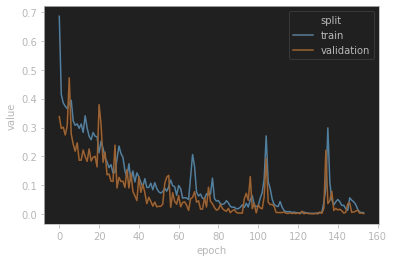

Acima pode-se observar o gráfico da função de perda do modelo, para os dados de treino e validação. Notasse que o treinamento foi interompido quando a função de perda parou de melhorar, o que ocorreu próximo da época 150, isso indica que o modelo foi treinado por um número suficiente de épocas e não foi treinado por mais épocas do que o necessário.

Obteve-se uma acurácia de 100% nos dados de teste e loss de 0.002.

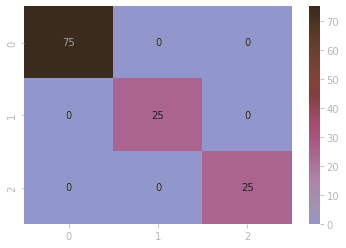

Acima pode-se observar a matriz de confusão do modelo, notasse que o modelo classificou corretamente todos os dados de teste.
